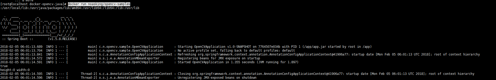

# 结合了Docker + Spring Boot 可以在镜像中运行的例子

镜像参考：https://github.com/noaskin/docker-opencv-java.git

### 运行

##### 1、准备

- 修改pom.xml中的仓库地址
- 修改Dockerfile中的镜像名称

##### 2、打包

```commandline
mvn clean install
cd opencv-samples
mvn clean install docker:build
```

##### 运行

```commandline
docker run noasking/opencv-samples
```

运行结果：



